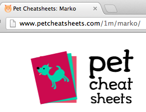

**Backstory:** On Saturday, November 17, 2012 [Audrey
Roy](http://audreymroy.com) and I decided to participate in the
[Petcentric](https://twitter.com/petcentric) hackathon, a Los Angeles
area Pet-themed product/coding contest held at
[Amplify](http://www.amplify.la/). We arrived a bit late, but armed with
Audrey's idea of creating a pet based reference sheet for owners, pet
sitters, vets, and anyone else needing a card with data on pets, we got
to work. About eight hours later we toggled a DNS switch and
[petcheatsheets.com](https://www.petcheatsheets.com) was live.

**Update:** Pet Cheatsheet's owner's pet information is private,
because it includes emergency contact information that often includes
phone numbers, email addresses, and even physical addresses of family
members and friends. Maintaining the privacy of pets and their owners
was also a consideration in implementation.

URL Design Thoughts
===================

During development, one of the things I considered carefully was URL
design of the primary feature, which was pets. The obvious choice was to
go with a design that identified owners with pets:

    /<owner_username>/<pet_name>/

However, upon reflection, this didn't sit well with me. What if a pet
changed owners? Identifying a pet with a particular owner in the URL
meant that if we ever added a 'transfer ownership' feature, there
would be extra work. Also, if we ever implemented a sharing feature,
changing URLs on a pet going to the same veterinarian their whole life
might make the veterinarian's list of pets and their URLs invalid.

With that in mind, I decided to go with an identifier and pet name,
where the pet name was actually not used in the lookup:

    /<pet_id>/<pet_name:not_required>/

One more thing, rather than just use the **pet** table's primary key as
`<pet_id>` I decided to go with base36 (0-9 and a-z) encoding. It's not
unlike what URL shortening services do, and if we gained any traction,
it makes recitation of a pet's URL easier. So the final result was
actually:

    /<pet_id:base_36_encoded>/<pet_name:not_required>/

Implementation
==============

Here's a simplified view of the final implementation, starting with the
model:

``` python
# pets/models.py
from django.db import models
from django.utils.translation import ugettext_lazy as _

class Pet(models.Model):

    name = models.CharField(_("Pet's name"), max_length=100)
    identifier = models.CharField(_("identifier"), max_length=50, 
        null=True, blank=True, db_index=True)
    # More fields...
```

Then the form:

``` python
# pets/forms.py
from django import forms

from pets.models import Pet

class PetForm(forms.ModelForm):

    class Meta:
        model = Pet
        fields = ('name', ) # more fields
```

With model and form, we build the views:

``` python
# pets/views.py
from django.shortcuts import get_object_or_404
from django.utils.baseconv import base36
from django.views.generic import CreateView, DetailView, UpdateView

from braces.views import LoginRequiredMixin

from pets.forms import PetForm

class PetCreateView(LoginRequiredMixin, CreateView):

    model = Pet
    form_class = PetForm

    def form_valid(self, form):
        pet = form.save()
        pet.identifier = base36.encode(pet.pk)
        pet.owner = self.request.user
        # Save again - it's not taking THAT many server cycles AND we needed
        #    the pet.pk in advance to generate the pet.identifier
        pet.save()
        return super(PetCreateView, self).form_valid(form)


class GetPetMixin(object):
    """ Any view that needs to get a Pet object can use this Mixin 

        Pet Cheatsheet's owner's pet information is private, because it
            includes emergency contact information that often includes phone
            numbers, email addresses, and even physical addresses of family
            members and friends.
    """

    def get_object(self):
        pet = get_object_or_404(Pet, identifier=self.kwargs['identifier'])

        if pet.owner != self.request.user:
            # Rather than a 'forbidden' result, we want to show a 'Pet Not
            #    Found' page so we can educate site users.
            raise Http404  
        return pet

class PetDetailView(LoginRequiredMixin, GetPetMixin, DetailView):
    pass

class PetUpdateView(LoginRequiredMixin, GetPetMixin, UpdateView):
    model = Pet
    form_class = PetForm

class PetPDFView(LoginRequiredMixin, GetPetMixin, DetailView):
    model = Pet

    # snip: lots of code for rendering the PDFs.
```

Then we wire up the views into the urls:

``` python
from django.conf.urls.defaults import patterns, url

from pets import views

urlpatterns = patterns("",

    url(
        regex=r"^build-cheatsheet/$",
        view=views.PetCreateView.as_view(),
        name="pet_create",
    ),
    url(
        regex=r"^update/(?P<identifier>[\w\d]+)/(?P<slug>[\w\d\-\_]+)/$",
        view=views.PetUpdateView.as_view(),
        name="pet_update",
    ),
    url(
        regex=r"^(?P<identifier>[\w\d]+)/(?P<slug>[\w\d\-\_]+)/$",
        view=views.PetDetailView.as_view(),
        name="pet_detail",
    ),
    # snip: a lot of other views
)
```

Result
======

In the image below you can see how Marko's URL has his own unique
identifier, along with his name. I can change the name in the URL or
even in the database, but so long as I don't modify the identifying
part of the URL (`1m`), his information always shows up.

]
