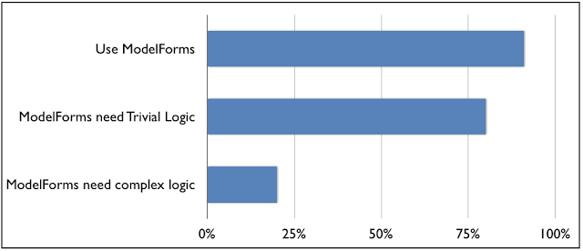
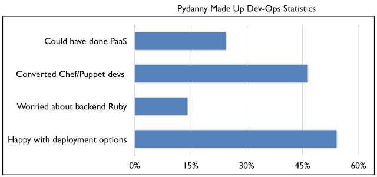
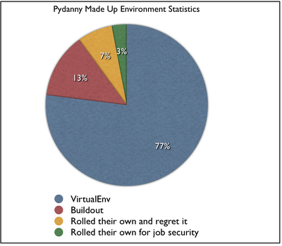
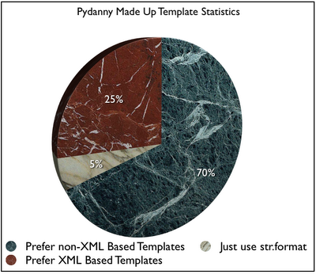
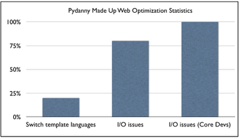

Years ago my good friend [Miguel Araujo](https://twitter.com/maraujop)
and I presented on [Advanced Django Form
Usage](http://speakerdeck.com/u/pydanny/p/advanced-django-forms-usage).
[Slide
18](http://www.slideshare.net/pydanny/advanced-django-forms-usage/52) of
that talk mentioned some made up statistics. Here they are for
reference:

-   91% of Django projects use ModelForms.
-   80% ModelForms require trivial logic.
-   20% ModelForms require complex logic.

In Chapter 10 of [Two Scoops of Django](https://twoscoopspress.org/products/two-scoops-of-django-1-5/) I
expanded on those made up statistics:

-   95% of Django projects should use ModelForms.
-   91% of all Django projects use ModelForms.
-   80% of ModelForms require trivial logic.
-   20% of ModelForms require complicated logic.

**Important Disclaimer**: These numbers were cooked out of thin air by
yours truly. I determined them with zero research, they carry absolutely
no scientific weight, and shouldn't be used in any serious argument.
They are wholly my opinion, which is good or bad depending on your point
of view and your own opinion of my opinions.

With that out of the way, here's a bar graph created from the fictional
data I presented with Miguel back in 2011:

{.img-polaroidalign-center}

You'll notice that my bar titles could be stronger. I actually did that
on purpose in case anyone tries to use that chart in real life. In any
case, if you thought that was interesting, then read on. I have many
more made-up statistics. For example, here are more numbers I've cooked
up:

Pydanny Made Up DevOps Statistics
=================================

Thanks to the cloud and a blizzard of hip, new tools, DevOps is the new
hotness. I know because every other Python meetup features someone
speaking on it - just like every other Ruby, Perl, and PHP meetup.
Anyway... numbers:

-   24.3% of [Python](http://python.org/) developers doing DevOps think
    they could have launched a PaaS (aka Heroku clone) before it got
    crowded.
-   46.3% of Python developers doing DevOps spend all their time writing
    Chef/Puppet scripts and yet still claim to be Python developers.
-   14% of Python developers are worried about so much of the backend
    being done in Ruby, but don't quite trust Salt or Ansible enough to
    use them.
-   54% of Python developers are just happy that there are many options
    now and don't care about the internal machinery that much.

This time, because I'm worried about the data being taken seriously,
I've titled the bar chart in such a way that no one will reference it
in anything important:

Pydanny Made Up Python Enviroment Statistics
============================================

Following the obvious logic flow (to me anyway) of DevOps to something
else, let's go into Python environments, also known as the
[VirtualEnv](http://pypi.python.org/pypi/virtualenv) vs
[Buildout](http://pypi.python.org/pypi/zc.buildout) debate, which adds
up to an even 100% (making it good pie chart material):

-   77% of Python Developers prefer VirtualEnv.
-   13% of Python Developers prefer Buildout. Many of them don't say
    this out loud.
-   7% of Python developers rolled their own solution and **wish they
    could switch over.**
-   3% of Python developers rolled their own solution and are fiendishly
    delighted with how they have guaranteed their own job security
    forever. I know who some of you are and I can say with some
    confidence that when the Zombie apocalypse happens, no one is going
    to invite you into their fortified compounds. **We hate you that
    much.**

{.img-polaroidalign-center}

Pydanny Made Up Template Debate Statistics
==========================================

The made up statistics in this post frequently touch on contentious
topics. So let me add another controversial topic, this time the never
ending template debate in Python:

-   70% of python developers prefer
    [non-XML](https://docs.djangoproject.com/en/1.5/ref/templates/)
    [templates](http://jinja.pocoo.org/docs/).
-   25% of python developers prefer [XML](http://www.makotemplates.org/)
    templates.
-   5% of python developers wonder why we don't just use the
    [str.format()](http://docs.python.org/library/string.html#formatstrings)
    method and be done with it.

The display for this data is a lovely pie chart as seen below. In order
to make it appear more useful, I made it a 3-D pie chart:

{.img-polaroidalign-center}

Pydanny Made Up Python Web Optimization Statistics
==================================================

I sometimes get asked how to best optimize a Django site. My answer is
'optimize your queries and use caching'. On the other hand, there are
those who disagree with me and start switching out Django internals
before doing anything silly like looking at I/O. My bet is this same
thing happens with other frameworks such as Flask and Pyramid.

-   20% developers argue switching template languages.
-   80% developers argue using caching and load balancing.
-   100% Django/Pyramid/Flask/etc core developers argue using caching
    and load balancing.

{.img-polaroidalign-center}

Of all the made up statistics in this blog post, I suspect this is the
one closest to the truth of things.

[Pydanny Made Up Debate Statistics](#debate-statistics)
=======================================================

Alright, let's conclude this article with some statistics I cooked up
in regards to various Python related topics.

-   95% of developers trying to create reusable Python packages have
    **no freaking idea** as to whether or not we should be using
    setuptools, distribute, or distribute2 and wish there was a **clear
    explanation on the front page** of PyPI as to what we should be
    using and how. Something like a link to the [Python Packaging User
    Guide](https://python-packaging-user-guide.readthedocs.org/en/latest/index.html)
    might be nice!
-   99% of us get frustrated with trying to reconcile the pronunciations
    of PyPI with PyPy.
-   97.2% of our family and friends have no idea what Two Scoops of
    Django is about.
-   62% of Python developers are wondering if Tulip will make their
    projects more web scale.
-   49% of Twisted developers wish that Python had accepted their
    standard instead of PEP-8.
-   42% of Python developers think Flask/Pyramid have awesome names that
    don't get mispronounced the same way Django does.
-   28% of Python developers wish they could find a way to get some
    SciPy into their projects.
-   23.6% of us get web.py and web2py confused with each other.

No chart? Getting this one to look meaningful was turning into a
herculean effort. I invite others to render this data into something
that look attractive and doesn't lose meaning. Come up with something
impressive and I'll put it into a follow-up blog post.

**Note:** This is a reprint and update of an earlier
[article](https://pydanny.blogspot.com/2011/12/made-up-statistics.html).

**Update**: Added link to the [Python Packaging User
Guide](https://python-packaging-user-guide.readthedocs.org/en/latest/index.html).
