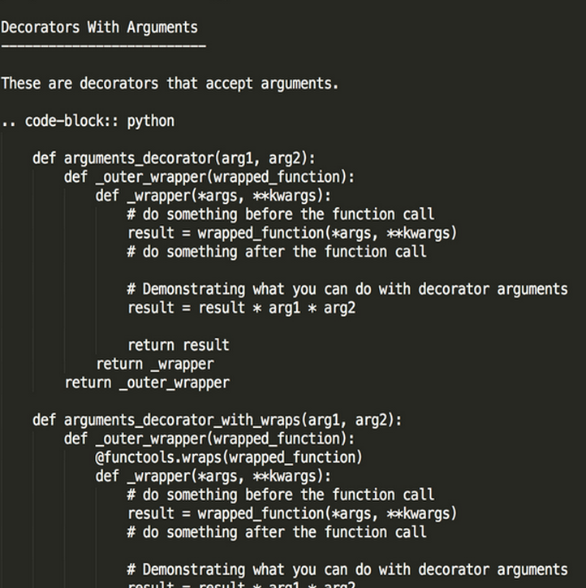

I can never remember the syntax for writing
[decorators](http://en.wikipedia.org/wiki/Python_syntax_and_semantics#Decorators).
I always have to look it up. Worse, I always have to remember where to
look to find references. Hence the reason for this article. I'll never
lose this reference: It's on my laptop and the internet.

Each type will include a basic version, a `functools.wraps` version, and
a [wrapt](https://github.com/GrahamDumpleton/wrapt) version.

Decorators Without Arguments
============================

These are decorators that do not accept arguments.

``` python
import functools  # Part of Python standard library

def decorator(wrapped_function):
    def _wrapper(*args, **kwargs):
        # do something before the function call
        result = wrapped_function(*args, **kwargs)
        # do something after the function call
        return result
    return _wrapper

# decorator with functools.wraps added
def decorator_with_wraps(wrapped_function):
    @functools.wraps(wrapped_function)
    def _wrapper(*args, **kwargs):
        # do something before the function call
        result = wrapped_function(*args, **kwargs)
        # do something after the function call
        return result
    return _wrapper

import wrapt  # Requires installing the 'wrapt' library

# decorator powered by wrapt
@wrapt.decorator
def decorator_with_wrapt(wrapped_function, instance, args, kwargs):
    # do something before the function call
    result = wrapped_function(*args, **kwargs)
    # do something after the function call
    return result

def test_decorators():

    @decorator
    def func1():
        return 'I'

    @decorator_with_wraps
    def func2():
        return 'code'

    @decorator_with_wrapt
    def func3():
        return 'python'

    assert func1() == 'I'
    assert func2() == 'code'
    assert func3() == 'python'
```

Decorators With Arguments
=========================

These are decorators that accept arguments.

``` python
def arguments_decorator(arg1, arg2):
    def _outer_wrapper(wrapped_function):
        def _wrapper(*args, **kwargs):
            # do something before the function call
            result = wrapped_function(*args, **kwargs)
            # do something after the function call

            # Demonstrating what you can do with decorator arguments
            result = result * arg1 * arg2

            return result
        return _wrapper
    return _outer_wrapper

def arguments_decorator_with_wraps(arg1, arg2):
    def _outer_wrapper(wrapped_function):
        @functools.wraps(wrapped_function)
        def _wrapper(*args, **kwargs):
            # do something before the function call
            result = wrapped_function(*args, **kwargs)
            # do something after the function call

            # Demonstrating what you can do with decorator arguments
            result = result * arg1 * arg2

            return result
        return _wrapper
    return _outer_wrapper

def arguments_decorator_with_wrapt(arg1, arg2):
    @wrapt.decorator
    def _wrapper(wrapped_function, instance, args, kwargs):
        # do something before the function call
        result = wrapped_function(*args, **kwargs)
        # do something after the function call

        # Demonstrating what you can do with decorator arguments
        result = result * arg1 * arg2

        return result
    return _wrapper


def test_arguments_decorators():

    @arguments_decorator(2, 3)
    def func4():
        return 'We'

    @arguments_decorator_with_wraps(2, 2)
    def func5():
        return 'code'

    @arguments_decorator_with_wrapt(3, 2)
    def func6():
        return 'python'

    assert func4() == 'WeWeWeWeWeWe'
    assert func5() == 'codecodecodecode'
    assert func6() == 'pythonpythonpythonpythonpythonpython'
```

Summary
=======

This article is a cheatsheet, not a tutorial.

Instead of explaining why Python has
[decorators](http://en.wikipedia.org/wiki/Python_syntax_and_semantics#Decorators),
how to use them, how they work, or why to use them, this article is a
reference. Nothing more.

References:

-   Graham Dumpleton's [voluminious series on
    decorators](https://github.com/GrahamDumpleton/wrapt/tree/develop/blog)
-   Graham Dumpleton's [Introspecting a
    function](https://github.com/GrahamDumpleton/wrapt/blob/develop/blog/01-how-you-implemented-your-python-decorator-is-wrong.md#introspecting-a-function)
    article on decorators for concerns about `functools.wraps`)
-   <https://wiki.python.org/moin/PythonDecoratorLibrary>


